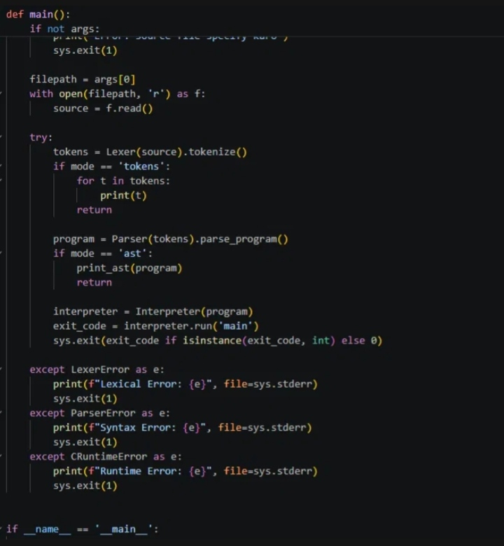
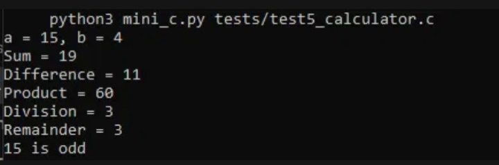
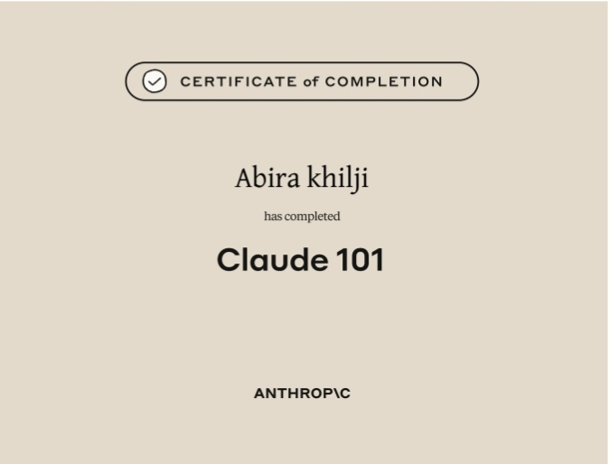
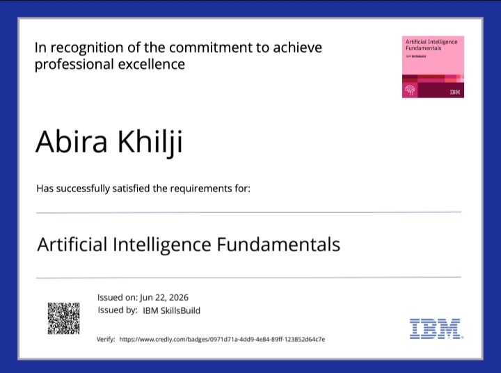
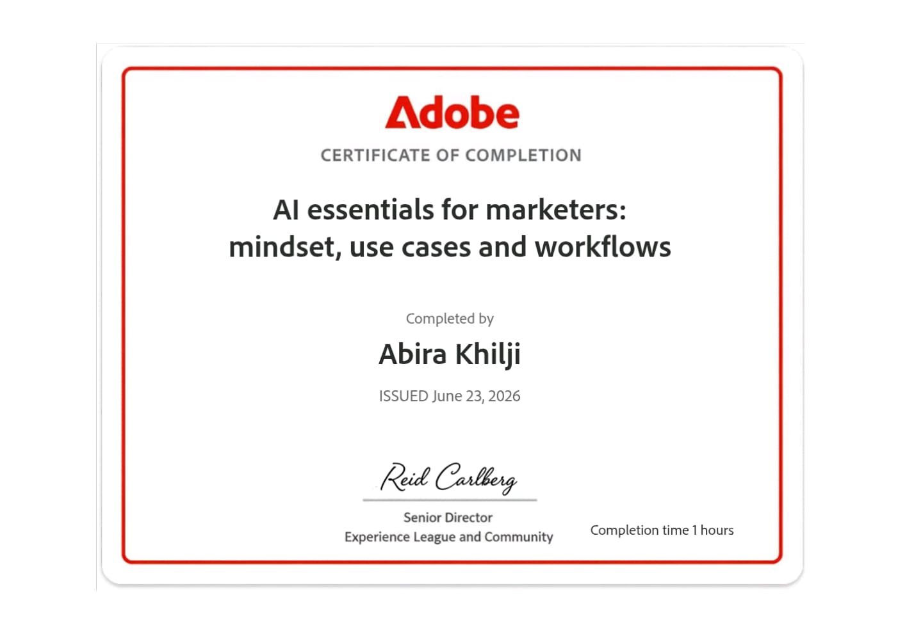
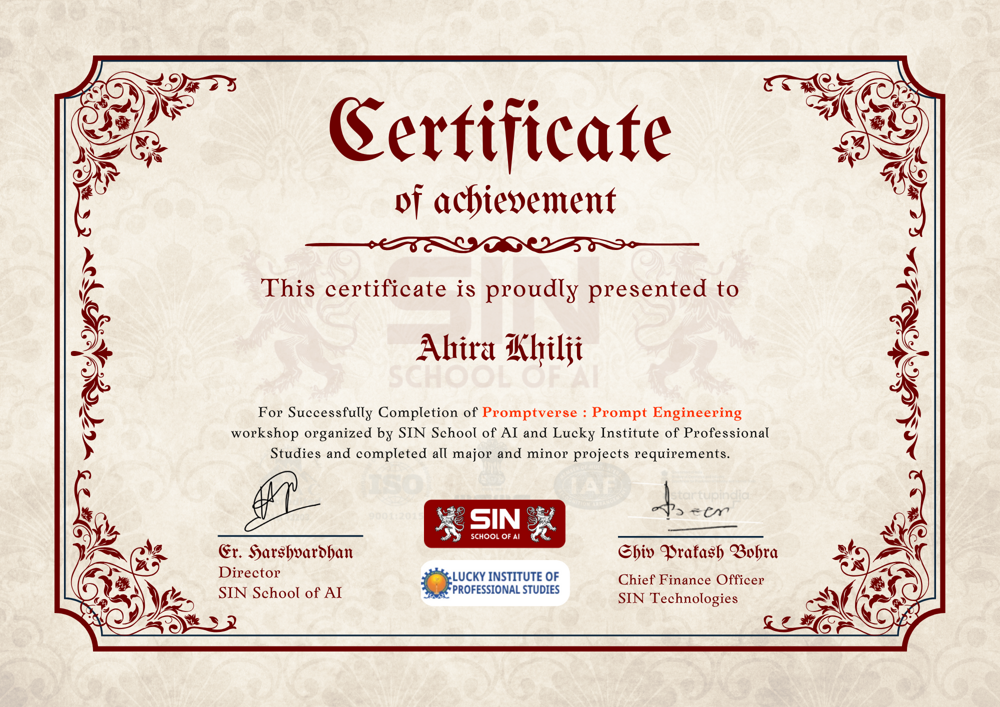

 

---

## 👋 About Me

I'm a **BCA student specializing in Information Technology**, with a strong interest in **Artificial Intelligence, Prompt Engineering, and software technologies**. I'm currently building my foundations in programming, databases, AI applications, and Git/GitHub while working on practical projects.

- 🎓 BCA — Information Technology
- 🤖 Passionate about AI & Prompt Engineering
- 💻 Learning C, C++ & Java
- 🗄️ Working with SQL & MySQL
- 🐙 Currently learning Git & GitHub
- 🚀 Interested in building a career in AI-related fields

---

## 🎓 Education

| Qualification | Details |
|---|---|
| **Bachelor of Computer Applications (BCA)** | Information Technology · Currently in 2nd Year · Expected Graduation: 2028 |
| **Class 12th** | PCM — Physics, Chemistry & Mathematics |

---

## 🤖 AI & Technology Focus

AI is one of my primary areas of interest, and I actively explore it alongside my core programming studies.

- Artificial Intelligence
- Prompt Engineering
- AI Applications
- AI Fundamentals
- AI-Assisted Creative Workflows
- Software Applications
- Exploring practical applications of AI

> I'm particularly interested in understanding how AI can be used to build useful software, automate workflows, and create innovative digital experiences.

---

## 🛠️ Tech Stack

**💻 Programming**

**🗄️ Database**

**🔧 Tools**

**🤖 AI**
`Artificial Intelligence Fundamentals` · `Prompt Engineering` · `AI Applications` · `AI Tools`

**🎨 Creative & Productivity**
`CapCut` · `Canva` · `AI Image Generation` · `AI Video Editing`

---

## 📚 Currently Learning

- 🔹 Git & GitHub
- 🔹 C Programming
- 🔹 C++
- 🔹 Java
- 🔹 AI & Prompt Engineering
- 🔹 Software Applications
- 🔹 Database Technologies
- 🔹 Practical AI Development

> Currently focused on strengthening my programming fundamentals while exploring AI and building practical projects.

---

## 🚀 Projects

### 🔹 C Interpreter ⭐

A C interpreter project developed to explore how programming languages are processed and executed — including lexing, parsing, and interpreting C source code. The project demonstrates my practical understanding of language-processing concepts (Lexer → Parser → Interpreter pipeline), along with proper error handling.

**Status:** Completed / Improving
**Tech:** `Python`

🔗 **Repository:** [github.com/abirakhilji/mini-c-compiler](https://github.com/abirakhilji/mini-c-compiler)

---

### 🔹 Chatbot 🤖

An earlier chatbot project created to explore conversational applications and AI-related concepts.

**Status:** Previous Project
**Tech:** _[Add the actual technology used]_

---

## 🎨 AI & Creative Skills

- 🤖 Artificial Intelligence
- ✨ Prompt Engineering
- 🧠 AI Applications
- 🖼️ AI Image Generation
- 🎬 AI Video Editing
- 🎥 Video Editing — CapCut
- 🎨 Graphic/Visual Design — Canva

> I also enjoy exploring the creative side of AI, including AI-assisted image generation, video editing, and digital content creation.

---

## 📜 Certifications

<table>
<tr>
<td align="center" width="50%">
 
🏆 <b>Claude 101</b> 
Anthropic
</td>
<td align="center" width="50%">
 
🏆 <b>Artificial Intelligence Fundamentals</b> 
IBM SkillsBuild
</td>
</tr>
<tr>
<td align="center" width="50%">
 
🏆 <b>AI Essentials for Marketers: Mindset, Use Cases and Workflows</b> 
Adobe
</td>
<td align="center" width="50%">
 
🏆 <b>Promptverse: Prompt Engineering</b> 
SIN School of AI & Lucky Institute of Professional Studies
</td>
</tr>
</table>

---

## 🎯 Career Goal

My goal is to build a career in the AI field, strengthen my foundations in software development and AI technologies, and eventually contribute to meaningful AI-driven products and solutions.

**Learning → Building → Improving → AI Career**

---

## 📊 GitHub Stats

---

## 🔥 My GitHub Journey

  

---

## 🤝 Let's Connect

